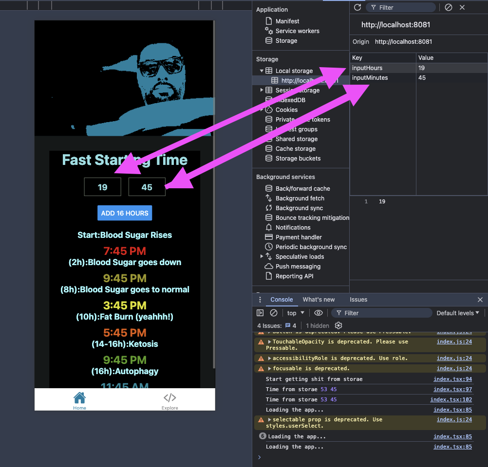

# Mobile fasting app 🍱 🥗 🍩 🍮


## 16-Hour Fast (16/8 Intermittent Fasting)

The 16-hour fast, commonly known as the 16/8 intermittent fasting method, involves fasting for 16 hours each day and restricting eating to an 8-hour window. This approach is popular for its simplicity and potential health benefits.

### Overview

- **Fasting Duration:** 16 hours
- **Eating Window:** 8 hours

### Stages

1. **Pre-Fast (Preparation):**

   - **Description:** Complete your last meal before the fasting period starts. A balanced meal with proteins, healthy fats, and fiber helps sustain you through the fast.

2. **Fasting Phase:**

   - **Description:** No caloric intake during the 16-hour fasting window. Hydration is key—drink water, herbal teas, or black coffee. The body shifts to using fat stores for energy.

3. **Eating Window:**

   - **Description:** Consume all meals and snacks within the 8-hour period. Focus on nutrient-dense foods to meet daily caloric and nutritional needs.

4. **Post-Eating Phase:**
   - **Description:** After the eating window closes, prepare for the next fasting period. Ensure you've eaten adequately during the 8-hour window.

### Benefits

- **Weight Management:** Aids in weight loss and maintenance.
- **Metabolic Health:** May enhance insulin sensitivity and support metabolic health.
- **Autophagy:** Promotes cellular repair processes through fasting.

### Considerations

- **Stay Hydrated:** Drink plenty of water during the fasting period.
- **Balanced Diet:** Focus on wholesome, nutrient-rich foods during the eating window.
- **Individual Needs:** Adapt based on personal health and lifestyle.

The 16-hour fast is a practical and effective time-restricted eating pattern that can integrate well into daily routines while supporting various health objectives.

The app will store your fasting information in the local storage so you don't lose it when you close the app


There are more futtures comming in the future

## Hot to build this app

1. Install dependencies

   ```bash
   npm install
   ```

2. Start the app

   ```bash
    npx expo start
   ```

## About the author

Ahmed Gadir
Follow me at:

- [Github](https://github.com/e17769/)
- [Linkedin](https://www.linkedin.com/in/ahmedgadir/)
- [Personal Page](https://ahmedgadir.com/)
- [YouTube Channel](https://www.youtube.com/watch?v=73RWR944tgE)
- [Podcast](https://www.youtube.com/@atlantadevtalk1198/featured)
